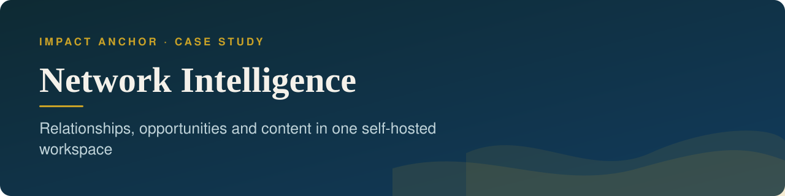
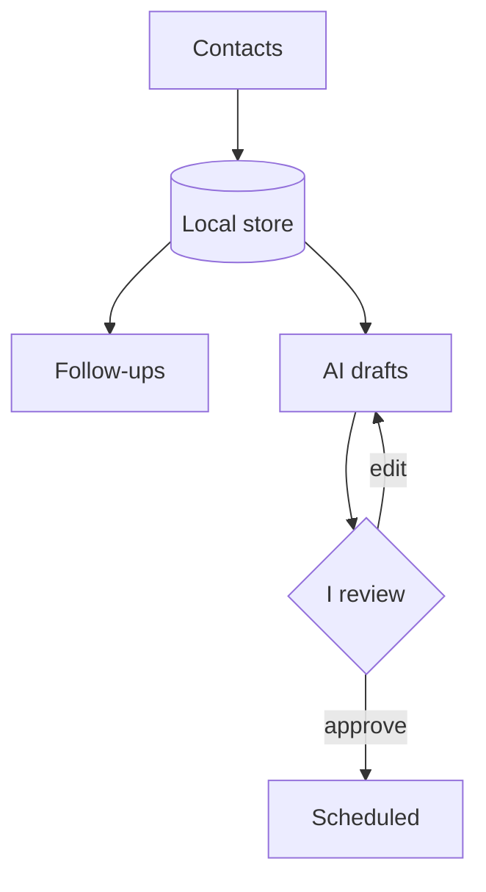

<b>Relationships, opportunities and content in one self-hosted workspace</b>

<b>Status:</b> Pilot, self-hosted &nbsp;·&nbsp; <b>Built by</b> <a href="https://github.com/Mohanad1st">Mohannad Hesham</a>

> This is a case study. The source is private because it is built to hold personal contact data.

## Why I built it

My network lives across LinkedIn, X and email, and the follow-ups, opportunities and content ideas that come out of it get lost between apps. This is a self-hosted workspace that ties people, conversations and posts together. AI helps draft, and I approve everything that goes out.

## What it does

- One contact list across LinkedIn, X and email, with duplicates merged.
- Opportunity tracking, and follow-up tasks to re-engage past contacts.
- Draft, review and approve posts, threads and newsletters in a consistent voice.
- Schedule approved content to social channels (built and tested, not yet used live).
- A workflow hub with run history, and a chat assistant over your own data.

## How it works

Screens aren&#x27;t shown because the app is built to hold personal contact data.

## What it's built on

Next.js · React · TypeScript · a local database · Claude for drafting · a social scheduling service

## Safeguards

- Nothing is published without review and approval.
- No automated liking, commenting, following or messaging on LinkedIn. Engagement stays manual.
- No background scraping of social feeds.
- Personal data is stored locally, and credentials are encrypted at rest.
- Access fails closed, and 173 automated tests run against an isolated test database.

## What it doesn't do

- It never likes, comments, follows or messages for you. It only publishes what you've approved.

## More from Impact Anchor

- [ImpactAnchor Reels](https://github.com/Mohanad1st/impactanchor-reels-showcase) — Recorded sessions in; scored, subtitled, scheduled short videos out
- [Impact Anchor: consulting site](https://github.com/Mohanad1st/impact-anchor-site-showcase) — From AI overwhelm to a working adoption plan, for mission-driven teams
- [AI Governance Roadmap](https://github.com/Mohanad1st/ai-governance-roadmap-showcase) — A free course that takes you from first definitions to a working AI governance plan
- [Anchor Learning Hub](https://github.com/Mohanad1st/anchor-learning-hub-showcase) — Interactive, bilingual, offline-ready learning for workshops and training programmes

---

© 2026 Mohannad Hesham. Showcase text and images only — no source code is published or licensed here. See all my work on <a href="https://github.com/Mohanad1st">my GitHub profile</a> · <a href="https://www.linkedin.com/in/mohannadhesham/">LinkedIn</a>.
