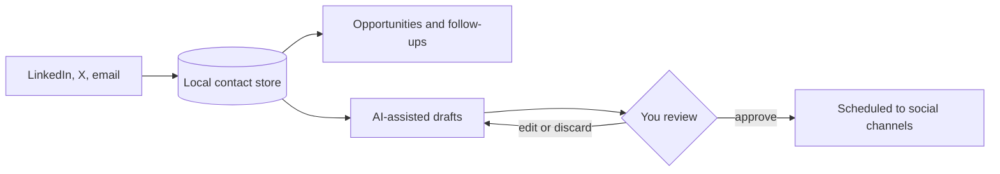

<b>Status:</b> Pilot, self-hosted &nbsp;·&nbsp; <b>Built by</b> <a href="https://github.com/Mohanad1st">Mohannad Hesham</a> &nbsp;·&nbsp; <b>Source:</b> private

> **This is a showcase, not the code.** The source is private because the system handles real operations for real people. Nothing here is needed to run it, and nothing here reveals how it is secured. A live walkthrough is available on request.

## The problem

A solo consultant's network lives across LinkedIn, X and email, and the follow-ups, opportunities and content ideas that come out of it get lost between apps. This is a self-hosted workspace that ties people, conversations and posts together, with AI helping to draft — and a person approving everything that goes out.

## What it does

- One contact list across LinkedIn, X and email, with duplicates merged
- Opportunity tracking and reminders to re-engage past contacts
- Draft, review and approve posts, threads and newsletters in a consistent voice
- Schedule approved content to social channels and sync back what was published
- A workflow hub with run history, and a chat assistant over your own data

## See it

How the work flows:

Screens are not shown because the app holds personal contact data.

## Built with

Next.js · React · TypeScript · local database · Claude for drafting · a social scheduling service

## Built responsibly

- Nothing is published without a review and approval step
- No automated liking, commenting, following or messaging on LinkedIn — engagement stays manual by design
- No background scraping of social feeds
- Personal data is stored locally, and credentials are encrypted at rest
- Access fails closed, and 170+ automated tests run against an isolated test database

## What it deliberately doesn't do

- It is not a growth-hacking or automation bot. It organises your own relationships; it does not act for you.

## More from Impact Anchor

- [ImpactAnchor Reels](https://github.com/Mohanad1st/impactanchor-reels-showcase) — Recorded sessions in; scored, subtitled, scheduled short videos out
- [Impact Anchor — consulting site](https://github.com/Mohanad1st/impact-anchor-site-showcase) — From AI overwhelm to a working adoption plan, for mission-driven teams
- [AI Governance Roadmap](https://github.com/Mohanad1st/ai-governance-roadmap-showcase) — A free, bilingual course that takes you from first definitions to a governance plan
- [Anchor Learning Hub](https://github.com/Mohanad1st/anchor-learning-hub-showcase) — Interactive learning your teams actually finish — white-label, bilingual, offline-ready

---

© 2026 Mohannad Hesham. Showcase text and images only — no source code is published or licensed here. See all my work on <a href="https://github.com/Mohanad1st">my GitHub profile</a> · <a href="https://www.linkedin.com/in/mohannadhesham/">LinkedIn</a>.
